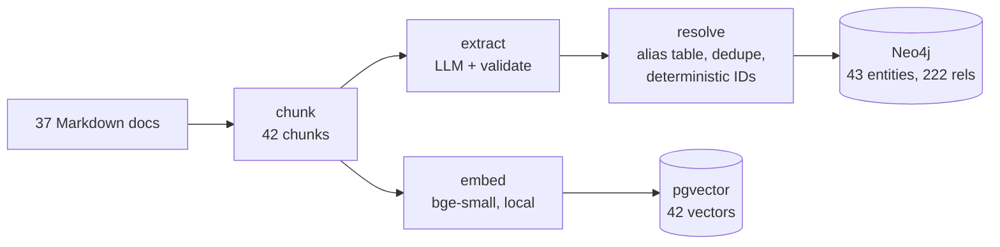
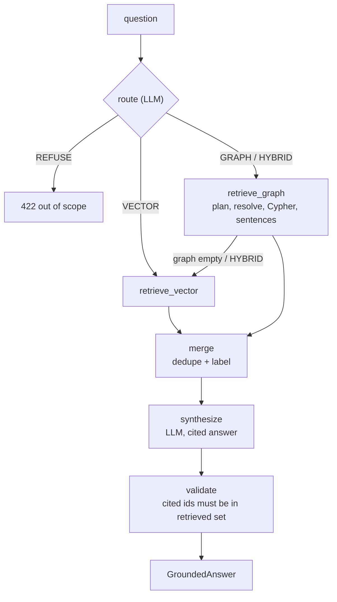

# Meridian Knowledge Graph RAG

A retrieval system that answers questions about software architecture by
combining **vector search** with **knowledge-graph traversal**. Each question is
routed to the strategy that fits it, the results are merged, and the answer comes
back with a citation for every claim.

The corpus is *Meridian*, a fictional fintech company's internal architecture
wiki (37 Markdown documents describing services, APIs, libraries, datastores,
teams, and two CVEs).

This is a learning project. It was built to understand RAG, Graph RAG, knowledge
extraction with LLMs, Neo4j, pgvector, and LangGraph end to end — and to
measure, honestly, whether a knowledge graph actually beats plain vector search
on this kind of corpus.


---

## Result

The graph did **not** beat the vector-only baseline on answer accuracy for this
corpus. The Meridian documents are densely cross-referenced (a database's page
lists every service that uses it), so vector search answers "multi-hop" questions
from a single page. The graph still wins on citation precision, refusal handling,
and questions no single document answers. Full analysis in
[`FINDINGS.md`](./FINDINGS.md).

| Category | Graph | Vector |
|----------|------:|-------:|
| 1-hop / definitional | 0.84 | 0.84 |
| 2-hop | 1.00 | 1.00 |
| 3-hop | 0.75 | 0.75 |
| aggregation | 1.00 | 1.00 |
| refusal | 1.00 | 1.00 |

A negative result, reported as a result. That is the point of the benchmark.

---

## Tech stack

[](https://skillicons.dev)

- **Orchestration:** LangChain, LangGraph (`StateGraph` query pipeline)
- **Graph store:** Neo4j 5 (Community), accessed only through parameterised
  Cypher templates
- **Vector store:** Postgres 16 + `pgvector` (exact cosine scan, 384-dim, no ANN
  index)
- **Embeddings:** `BAAI/bge-small-en-v1.5`, run locally — no API call
- **LLMs:** Groq (`gpt-oss-120b` / `gpt-oss-20b`) with Google Gemini as an
  automatic fallback; both on the free tier
- **API:** FastAPI + Uvicorn
- **Tooling:** pytest, ruff, Docker Compose

---

## Features

- **Question router** — one small LLM call classifies each question as
  `VECTOR`, `GRAPH`, `HYBRID`, or `REFUSE` before any retrieval runs. 95% accurate
  on a labelled set.
- **Graph retriever** — the LLM fills a typed query plan (which entity, which
  edge, which direction); the code maps that to one of seven reviewed Cypher
  templates. The model never writes Cypher against the database.
- **Vector retriever** — exact cosine similarity over ~42 chunks; recall@1 = 1.00
  on the sanity set.
- **Merge + labelled context** — graph facts and passages are deduped and passed
  to synthesis under explicit `GRAPH FACTS` / `RETRIEVED PASSAGES` headers.
- **Cited synthesis** — every claim in the answer carries a `chunk_id`.
- **Citation validator** — any cited source not in the retrieved set triggers one
  regeneration with an allow-list; leftover bad citations are dropped with a note.
  100% cited-source validity on the sample.
- **Deterministic, idempotent ingestion** — deterministic IDs + `MERGE` mean
  re-running the ingest changes zero rows. Extraction is cached, so a full
  rebuild is about two minutes and costs nothing.

---

## Architecture

The build follows a strict split:

- **The framework does the plumbing** — loaders, splitters, model wrappers,
  structured output, `PGVector`, `Neo4jGraph`, the `StateGraph` runtime.
- **The interesting parts are hand-written** — the router, the graph query
  planner and Cypher templates, the entity resolver, and the citation validator.

`GraphCypherQAChain` is deliberately not used: letting an LLM author Cypher
against a live database is an injection risk and makes results non-reproducible.
A typed plan mapped to fixed templates trades some coverage for safety.

See [`architecture.md`](./architecture.md) for the full design and
[`PHASE_BUILD.md`](./PHASE_BUILD.md) for a file-by-file build log.

### Ingestion (one-time, cached)



### Query pipeline (LangGraph `StateGraph`)



---

## Folder structure

```
.
├── data/                     Meridian corpus (37 docs) + ontology, schema, benchmark
├── src/
│   ├── config.py             the only file that builds provider clients
│   ├── models/               Pydantic v2 models (domain, extraction, routing, answer)
│   ├── ingest/               chunk, extract, resolve, load_graph, load_vector
│   ├── graph/                Neo4j client + every Cypher string (queries.py)
│   ├── pipeline/             router, retrieve_graph, retrieve_vector, merge,
│   │                         synthesize, validate, graph.py (StateGraph)
│   ├── baselines/            vector_only.py (the benchmark control)
│   └── api/                  FastAPI app: POST /query, GET /health
├── scripts/                  check_setup, ingest_corpus, benchmark, score_benchmark
├── tests/                    one test module per source module + fixtures/
└── docs/                     walkthrough, file guide
```

A per-file explanation is in [`docs/FILE_GUIDE.md`](./docs/FILE_GUIDE.md).

---

## Requirements

- Python 3.11 or 3.12
- Docker (for Neo4j and Postgres)
- A free [Groq](https://console.groq.com) API key
- A free [Google AI Studio](https://aistudio.google.com/apikey) API key (fallback)

No GPU. Embeddings run on CPU.

---

## Run locally

```bash
# 1. datastores
docker compose up -d

# 2. environment
python -m venv .venv && . .venv/Scripts/activate   # Linux/macOS: source .venv/bin/activate
pip install -e ".[dev]"

# 3. secrets
cp .env.example .env                                # then fill GROQ_API_KEY and GOOGLE_API_KEY

# 4. verify setup
python scripts/check_setup.py                       # expect: Phase 0 gate: PASS

# 5. build the indexes (about 2 minutes, $0 from cache)
python scripts/ingest_corpus.py --wipe

# 6. serve
uvicorn src.api.main:app --reload                   # http://localhost:8000/docs
```

Detailed notes (Windows Postgres port clash, Hugging Face cold start, free-tier
limits) are in [`SETUP.md`](./SETUP.md).

---

## Demo

Ask a question once the API is running:

```bash
curl -s localhost:8000/query -H 'content-type: application/json' \
  -d '{"question": "If Log4Shell is exploited, which Meridian products are affected?"}'
```

```json
{
  "question": "If Log4Shell is exploited, which Meridian products are affected?",
  "answer": "Ledger Service and Payments Platform are affected.",
  "citations": [
    { "claim": "The Ledger Service depends on Log4j", "chunk_id": "libraries/log4j.md", "source_type": "GRAPH" }
  ],
  "routing_used": "GRAPH",
  "graph_paths": ["The vulnerability affects Log4j.", "Ledger Service depends on Log4j."],
  "latency_ms": 8670
}
```

(Answer text illustrative; latency is a real warm-cache measurement.)

A full walkthrough — every script and test from Phase 1 to Phase 5, with
expected output — is in [`docs/WALKTHROUGH.md`](./docs/WALKTHROUGH.md).

Quick test run:

```bash
pytest -m "not llm and not neo4j and not pgvector"   # 237 offline tests, ~20 s
```

---

## API reference

### `POST /query`

| Field | Type | Default | Notes |
|-------|------|---------|-------|
| `question` | string | — | 1–1000 characters, required |
| `top_k` | int | 5 | reserved; the pipeline uses its own default |
| `max_hops` | int | 3 | reserved |

Responses:

| Status | Body | When |
|--------|------|------|
| `200` | `GroundedAnswer` (`answer`, `citations[]`, `routing_used`, `graph_paths[]`, `vector_passages[]`, `notes[]`, `latency_ms`) | answered |
| `422` | `{ error: "out_of_scope", reason, message }` | router refused (opinion, forecast, out of domain) |
| `400` | `{ error: "bad_request", message }` | empty or oversized question |
| `503` | `{ error: "unavailable", message }` | Neo4j or Postgres unreachable |

### `GET /health`

`200` with `{ status: "ok" | "degraded", neo4j, postgres }` — `200` even when a
store is down; the body says which.

Interactive docs at `/docs` when the server is running.

---

## Roadmap

Phases 0–5 are complete. Known open items, in rough priority order:

- **Extraction eval (Phase 1.5)** — a labelled precision/recall/F1 check on the
  ~25 benchmark-critical relationships. Would catch the known citation-attribution
  bug where every `USES PostgreSQL` edge points at the CVE document.
- **A `chain` query template** — a bounded variable-length path with typed
  endpoints, to cover genuine 3-hop questions (the one benchmark question the
  current six query-plan shapes cannot express).
- **Run the full 30-question benchmark** on a paid LLM tier (the set was cut to
  14 to fit the free-tier daily quota).
- **HNSW index** — only once the corpus is 10⁴+ vectors; irrelevant at 42.

---

## Lessons learned

- **RAG is retrieval *plus generation*.** Vector search and graph traversal only
  find context; an LLM still has to write the cited answer. That call is the cost
  and latency floor, not the retrieval.
- **Graph RAG is not automatically better.** Its advantage depends on the corpus.
  If the source documents already aggregate their relationships, plain vector
  search matches it. The graph earns its keep on distributed facts, exact-set
  completeness, and aggregation.
- **Constrain the LLM's authority.** A typed query plan mapped to reviewed Cypher
  templates is safer and more reproducible than letting the model write queries —
  at the cost of coverage for question shapes nobody templated.
- **Determinism makes ingestion cheap.** Deterministic IDs + `MERGE` + a cached
  extraction step turn a re-ingest into a two-minute no-op.
- **Free-tier daily quotas are the real constraint.** Build the cache once; never
  iterate against live LLM APIs; design evals to be resumable.
- **Neo4j and pgvector** — modelling a domain as a labelled property graph,
  writing parameterised Cypher, and joining a graph store to a vector store on a
  shared key (`chunk_id`).
- **Report the negative result.** The benchmark was built to answer a question,
  and "no measurable win on this corpus" is a valid answer.

---

## Documentation

| File | Contents |
|------|----------|
| [`docs/WALKTHROUGH.md`](./docs/WALKTHROUGH.md) | run every script and test, phase by phase, with expected output |
| [`docs/FILE_GUIDE.md`](./docs/FILE_GUIDE.md) | one line per source file |
| [`architecture.md`](./architecture.md) | system design, data models, module responsibilities |
| [`PHASE_BUILD.md`](./PHASE_BUILD.md) | file-by-file build log with rationale |
| [`FINDINGS.md`](./FINDINGS.md) | benchmark analysis: where the graph wins and loses |
| [`BENCHMARK_RESULTS.md`](./BENCHMARK_RESULTS.md) | per-question graded results |
| [`SETUP.md`](./SETUP.md) | detailed local setup and gotchas |
| [`CONTRIBUTING.md`](./CONTRIBUTING.md) | conventions if you want to open a PR |
| [`README_SPEC.md`](./README_SPEC.md) | index to the original planning docs (`prd`, `architecture`, `rules`, `phases`) |
| [`data/README.md`](./data/README.md) · [`data/ONTOLOGY.md`](./data/ONTOLOGY.md) | the corpus and its vocabulary |

---

## Contributing

This is a personal learning project and not actively seeking contributions, but
issues and suggestions are welcome. See [`CONTRIBUTING.md`](./CONTRIBUTING.md).

## Author

**Shaikh Rumman Fardeen**
[rummanfardeen4567@gmail.com](mailto:rummanfardeen4567@gmail.com)

## License

MIT — see [`LICENSE.md`](./LICENSE.md).

---

## Appendix

**Why "Meridian"?** The corpus is fabricated. It describes a fictional fintech so
that the benchmark questions have unambiguous gold answers and nothing depends on
real, changing systems.

**Graph size.** 43 entities, 222 relationships. The entity count sits just under
the planned 45–65 range because the corpus genuinely resolves to 43 distinct
nodes. The relationship count runs high because edges are keyed on
`source_chunk_id` for provenance, so a fact stated in three documents is three
edges (distinct `(source, type, target)` triples ≈ 130).

**Cost.** Ingestion and every benchmark run were done on free API tiers, total
spend $0. Embeddings are local. The one-time extraction is cached in
`cache/llm.db`.
