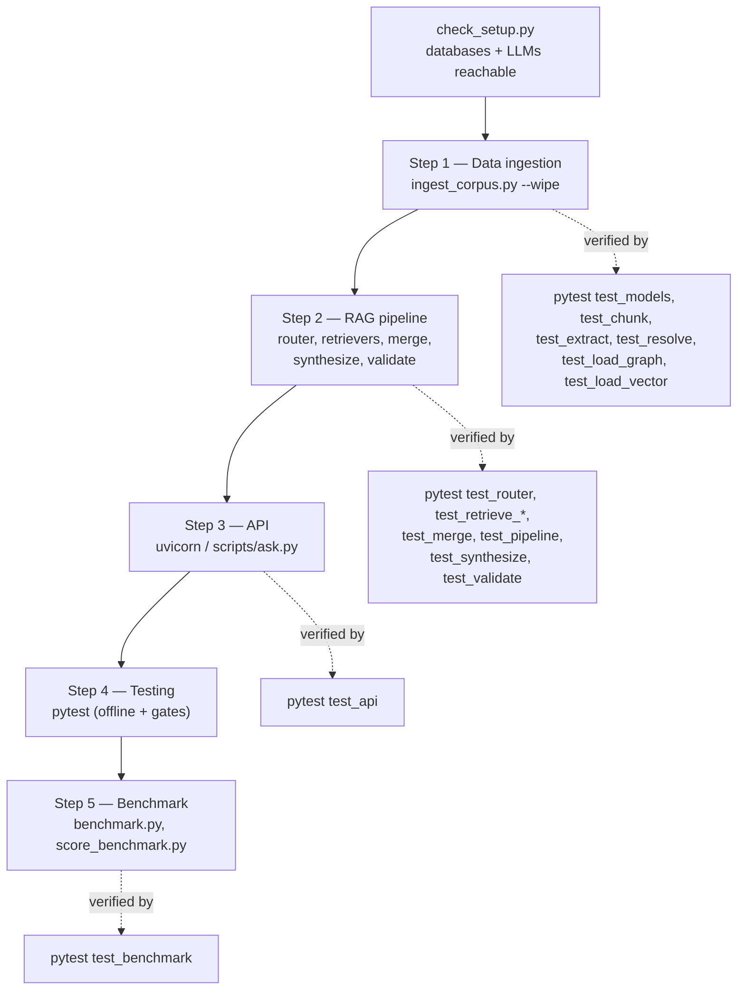

# Walkthrough

Every script and test, step by step, with the output to expect. Assumes the
setup in [`SETUP.md`](./SETUP.md) is done: containers up, `.venv` active,
`pip install -e ".[dev]"`, `.env` filled.

Run scripts with the repo root on the path:

```bash
export PYTHONPATH=.          # Windows PowerShell: $env:PYTHONPATH="."
```

## The sequence



Markers used below:

| Marker | Needs |
|--------|-------|
| _(none)_ | nothing external |
| `-m neo4j` | Neo4j running + corpus loaded |
| `-m pgvector` | Postgres running + corpus loaded |
| `-m llm` | Groq / Google keys (calls are cached after the first run) |

---

## Getting started

```bash
python scripts/check_setup.py
```

Pings both databases, the `vector` extension, the local embedding model, and both
LLM providers.

```
[ok] Neo4j        bolt://localhost:7687
[ok] Postgres     pgvector extension present
[ok] Embeddings   BAAI/bge-small-en-v1.5  (dim 384)
[ok] Groq         openai/gpt-oss-120b
[ok] Google       gemini-3.6-flash

Setup gate: PASS
```

---

## Step 1 — Data ingestion

### Offline tests (models, chunking, extraction, resolution)

```bash
pytest tests/test_models.py tests/test_chunk.py tests/test_extract.py \
       tests/test_resolve.py tests/test_load_graph.py -m "not llm and not neo4j"
```

```
... passed
```

The `-m llm` tests in `test_extract.py` do a real (cached) extraction of three
service documents and check the retry-on-invalid-JSON path.

### Build the graph and the vector index

```bash
python scripts/ingest_corpus.py --wipe
```

Chunks the corpus, extracts entities and relationships (cache hits, no API
calls), resolves aliases and duplicates, then `MERGE`s into Neo4j and pgvector.

```
=== ingest summary ===
chunks: 42   extracted ok: 42   deferred: 0   failed: 0
entities: 43   relationships: 222
edges missing evidence/source: 0
edges skipped (bad endpoint): 0
vectors: 42 chunks embedded (384-dim, local)
elapsed: 2.0 min

entities by type:
  Service            8
  API                6
  Library            5
  ...
relationships by type:
  DEPENDS_ON         44
  USES               37
  OWNED_BY           27
  ...

Ingestion gate: CHECK
```

`CHECK` means the counts are just outside the originally planned ranges (43
entities vs. 45–65; 222 edges vs. 140–200), both explained in the summary and the
README appendix — the corpus really has 43 distinct entities, and edges are keyed
on `source_chunk_id` for provenance.

Re-run it — the counts do not change. That is the idempotency guarantee.

> **Note.** `pytest -m neo4j` includes `test_load_graph.py`, and `-m pgvector`
> includes `test_load_vector.py`; both **wipe and rebuild** their index. After
> running the full marked suite, re-run `python scripts/ingest_corpus.py --wipe`.

### Vector recall check

```bash
pytest tests/test_load_vector.py tests/test_retrieve_vector.py -m "not pgvector"
pytest tests/test_retrieve_vector.py -m pgvector
```

```
tests/test_retrieve_vector.py::test_vector_retrieval_gate PASSED
tests/test_retrieve_vector.py::test_recall_at_5_clears_the_gate PASSED
```

`test_recall_at_5_clears_the_gate` runs 12 definitional questions through
`retrieve_vector` and checks the gold chunk lands in the top 5. Result: recall@1
is 1.00 — with ~42 distinct-topic vectors and an exact scan, the nearest chunk is
the right chunk, which is why there is no ANN index.

---

## Step 2 — RAG pipeline

### Router

```bash
pytest tests/test_router.py -m "not llm"          # confidence-floor + fixture hygiene
pytest tests/test_router.py -m llm                # accuracy gate (cached)
```

```
tests/test_router.py::test_router_accuracy_clears_the_gate PASSED
```

Accuracy is 95.2% on 21 labelled questions disjoint from the few-shot examples.
[`results/ROUTING_METRICS.md`](./results/ROUTING_METRICS.md) is a committed
snapshot of one run's confusion matrix.

### Graph retriever

```bash
pytest tests/test_retrieve_graph.py -m "not llm and not neo4j"   # pure + fake-client
pytest tests/test_retrieve_graph.py -m "llm and neo4j"           # gate: B09/B14/B16/B17/B24
```

```
tests/test_retrieve_graph.py::test_graph_retrieval_gate PASSED
```

The gate checks each question returns the exact set of gold nodes and the Cypher
runs under 200 ms (it runs in 12–56 ms).

### Vector retriever

Covered above (`test_retrieve_vector.py`).

### Merge and pipeline wiring

```bash
pytest tests/test_merge.py tests/test_pipeline.py
```

`test_pipeline.py` exercises every route and both fallback edges (graph empty →
vector, nothing retrieved → REFUSE) with fake retrieval functions.

### Synthesis and citation validation

```bash
pytest tests/test_synthesize.py tests/test_validate.py -m "not llm"
pytest tests/test_synthesize.py tests/test_validate.py -m llm
```

```
tests/test_synthesize.py::test_synthesis_gate PASSED
tests/test_validate.py::test_validation_gate PASSED
```

Every sample answer is non-empty, has at least one citation, and every cited
`chunk_id` is in the retrieved set. The validation gate also splices a fake
citation into a real answer and checks it is removed.

### Ask a question

```bash
python scripts/ask.py "Which services use PostgreSQL?"
```

```
route:   GRAPH
latency: 8 ms

Auth Service, Billing Service, Ledger Service, Reporting Service, and User Service use PostgreSQL.

sources:
  - [GRAPH] databases/postgresql.md
```

```bash
python scripts/ask.py "Is PostgreSQL better than MySQL?"
```

```
route:   REFUSE
answer:  Out of scope. This system answers questions about Meridian's architecture
         and ownership, not opinions, forecasts, or costs.
```

`--json` prints the raw `GroundedAnswer`.

---

## Step 3 — API

```bash
pytest tests/test_api.py -m "not llm"             # 400 / 422 / 503 / health, stubbed
pytest tests/test_api.py -m llm                   # gate: one real request per route
```

```
tests/test_api.py::test_api_gate PASSED
```

Then run the server:

```bash
uvicorn src.api.main:app
```

`scripts/ask.py` calls the pipeline directly (no server needed). To hit the HTTP
endpoint, open `http://localhost:8000/docs` and use the interactive form, or call
it from Python:

```python
import httpx
r = httpx.post("http://localhost:8000/query", json={"question": "Which services use PostgreSQL?"})
print(r.status_code, r.json()["answer"])
```

An out-of-scope question returns `422` with `{"error": "out_of_scope", ...}`.

---

## Step 4 — Testing (everything at once)

```bash
# offline — fast, no external services
pytest -m "not llm and not neo4j and not pgvector"
# -> 237 passed

# integration gates — needs containers + keys (cached calls)
pytest -m "llm or neo4j or pgvector"

# restore the indexes, since test_load_graph / test_load_vector wipe them:
python scripts/ingest_corpus.py --wipe
```

---

## Step 5 — Benchmark

### Run both systems

```bash
python scripts/benchmark.py                      # all 14 questions, both systems
python scripts/benchmark.py --questions B17,B24   # a subset
```

Writes `tests/fixtures/benchmark_run.json` after every call, so it resumes if
interrupted (a cold-cache run will not finish in one pass on the free tier).

```
ran 14 questions x 2 system(s)
raw -> benchmark_run.json   grading skeleton -> docs/results/BENCHMARK_RESULTS.md
```

### Score

The results file already carries the manual grades. Recompute the category means
and gate:

```bash
python scripts/score_benchmark.py
```

```
=== benchmark scores ===
category       graph  vector   delta  gate
1-hop           0.84    0.84   +0.00 [  ok ] |delta|=0.00 <= 0.05
2-hop           1.00    1.00   +0.00 [ FAIL] delta=+0.00 >= 0.15
3-hop           0.75    0.75   +0.00 [ FAIL] delta=+0.00 >= 0.3  (1 ungraded)
aggregation     1.00    1.00   +0.00 [ FAIL] graph=1.00>=0.8, vector=1.00<=0.2
refusal         1.00    1.00   +0.00 [  ok ] not gated
```

The `FAIL` rows are the finding, not a bug — see
[`results/FINDINGS.md`](./results/FINDINGS.md).

```bash
pytest tests/test_benchmark.py                    # parser + scorer, offline
```
